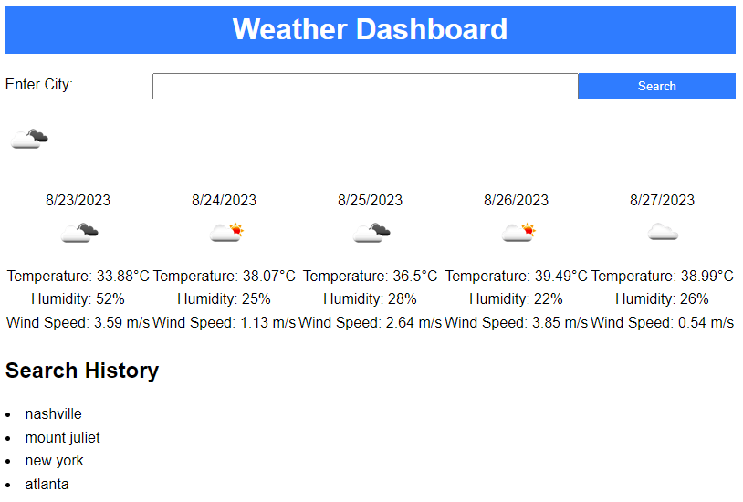

# Challenge-6

## Website link

- https://miekooooo.github.io/Challenge-6/

## Instructions
1. Enter a city
2. Then the current and weather forecast will be displayed
3. Enter another city for the previous to be saved in your history

## Description
- A weather forecast application that is simple in design but still displays all the info you would want out of a weather application.

- "what was my motivation?" To better understand APIs and how to call certain info.
- "why did I build this project?" To create a simple application using APIs.
- "what problem does it solve?" If you didn't have a weather app or any way of getting weather this would be a good alternative.
- "what did I learn?" I have a better understanding about APIs.

## Features

- Search history
- Weather data
- Future weather data

## Screenshots

- 
- 
- 

## Usage

- A simple and fast way to get weather forecast and current weather data.

## Credits

## License 

MIT License

Copyright (c) [2023] [Locket Layne]

Permission is hereby granted, free of charge, to any person obtaining a copy
of this software and associated documentation files (the "Software"), to deal
in the Software without restriction, including without limitation the rights
to use, copy, modify, merge, publish, distribute, sublicense, and/or sell
copies of the Software, and to permit persons to whom the Software is
furnished to do so, subject to the following conditions:

The above copyright notice and this permission notice shall be included in all
copies or substantial portions of the Software.

THE SOFTWARE IS PROVIDED "AS IS", WITHOUT WARRANTY OF ANY KIND, EXPRESS OR
IMPLIED, INCLUDING BUT NOT LIMITED TO THE WARRANTIES OF MERCHANTABILITY,
FITNESS FOR A PARTICULAR PURPOSE AND NONINFRINGEMENT. IN NO EVENT SHALL THE
AUTHORS OR COPYRIGHT HOLDERS BE LIABLE FOR ANY CLAIM, DAMAGES OR OTHER
LIABILITY, WHETHER IN AN ACTION OF CONTRACT, TORT OR OTHERWISE, ARISING FROM,
OUT OF OR IN CONNECTION WITH THE SOFTWARE OR THE USE OR OTHER DEALINGS IN THE
SOFTWARE.